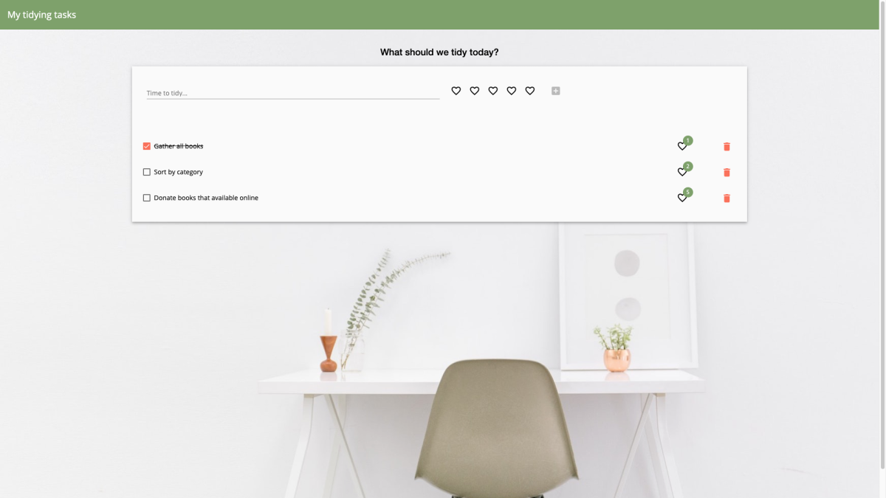

# Using component harnesses to write tests and creating a test harness for a custom component

This is a tidy task todo list app with unit test examples. There are tests without using component harnesses and corresponding tests using component harnesses.
There's a custom UI component that has a test harness implementation along with tests for the test harness.

The code in this repo is used by [Tidying up your unit tests](https://alisaduncan.github.io/component-harness/) presentation.

This project was generated with [Angular CLI](https://github.com/angular/angular-cli) version 12.0.3.

## Environment setup instructions

```sh
git clone
npm ci
```

## Serve the app

Run `npm start`  or `ng serve` for a dev server. Navigate to `http://localhost:4200/`. The app will automatically reload if you change any of the source files.

## Running unit tests

Run `ng test` to execute the unit tests via [Karma](https://karma-runner.github.io).
